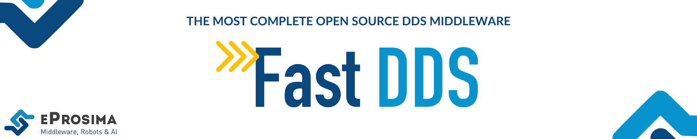

 

    <strong>
        <a href="https://eprosima.com/index.php/downloads-all">Download</a>
        &nbsp;&nbsp;•&nbsp;&nbsp;
        <a href="https://eprosima.com/index.php/products-all/eprosima-fast-dds#Available_Documentation">Docs</a>
        &nbsp;&nbsp;•&nbsp;&nbsp;
        <a href="https://eprosima.com/index.php/company-all/news">News</a>
        &nbsp;&nbsp;•&nbsp;&nbsp;
        <a href="https://twitter.com/EProsima">Twitter</a>
        &nbsp;&nbsp;•&nbsp;&nbsp;
        <a href="mailto:info@eprosima.com">Contact Us</a>
    </strong>

  

    
    
    
    
    
    
    
     
    
    
    
    
    

  

*eprosima Fast DDS* is a C++ implementation of the DDS (Data Distribution Service) standard of the OMG (Object Management Group).
eProsima Fast DDS implements the RTPS (Real Time Publish Subscribe) protocol, which provides publisher-subscriber communications over unreliable transports such as UDP, as defined and maintained by the Object Management Group (OMG) consortium.
RTPS is also the wire interoperability protocol defined for the Data Distribution Service (DDS) standard.
*eProsima Fast DDS* expose an API to access directly the RTPS protocol, giving the user full access to the protocol internals.

Some of the main features of this library are:

* Configurable best-effort and reliable publish-subscribe communication policies for real-time applications.
* Plug and play connectivity so that any new applications are automatically discovered by any other members of the network.
* Modularity and scalability to allow continuous growth with complex and simple devices in the network.
* Configurable network behavior and interchangeable transport layer: Choose the best protocol and system input/output channel combination for each deployment.
* Two API Layers: a high-level Publisher-Subscriber one focused on usability (DDS) and a lower-level Writer-Reader one that provides finer access to the inner workings of the RTPS protocol.

*eProsima Fast DDS* has been adopted by multiple organizations in many sectors including these important cases:

* Robotics: ROS (Robotic Operating System) as their default middleware for every ROS 2 long term (LTS) releases and most of the non-LTS releases.
* EU R&D: FIWARE Incubated GE.

This project is part of [FIWARE](https://www.fiware.org/).
For more information check the FIWARE Catalogue entry for [Robotics](https://github.com/Fiware/catalogue/tree/master/robotics).

## Commercial support

Looking for commercial support? Write us to info@eprosima.com

Find more about us at [eProsima’s webpage](https://eprosima.com/).

## Want us to share your project with the community?

Write to evaluation.support@eprosima.com or mention @EProsima on Twitter.
We are curious to get to know your use case!

## Supported platforms

More information about the official support can be found [here](https://github.com/eProsima/Fast-DDS/blob/master/PLATFORM_SUPPORT.md#platform-support)

## Installation Guide
You can get either a binary distribution of *eprosima Fast DDS* or compile the library yourself from source.
Please, refer to [Fast DDS documentation](https://fast-dds.docs.eprosima.com/en/latest/installation/binaries/binaries_linux.html) for the complete installation guide.

### Installation from binaries
The latest, up to date binary release of *eprosima Fast DDS* can be obtained from the <a href='http://www.eprosima.com'>company website</a>.

## Documentation

You can access the documentation online, which is hosted on [Read the Docs](https://fast-dds.docs.eprosima.com).

* [Start Page](https://fast-dds.docs.eprosima.com)
* [Installation manual](https://fast-dds.docs.eprosima.com/en/latest/installation/binaries/binaries_linux.html)
* [User manual](https://fast-dds.docs.eprosima.com/en/latest/fastdds/getting_started/getting_started.html)
* [Fast DDS-Gen manual](https://fast-dds.docs.eprosima.com/en/latest/fastddsgen/introduction/introduction.html)
* [Fast DDS CLI manual](https://fast-dds.docs.eprosima.com/en/latest/fastddscli/cli/cli.html)
* [eProsima Docker image manual](https://fast-dds.docs.eprosima.com/en/latest/docker/docker.html)
* [Release notes](https://fast-dds.docs.eprosima.com/en/latest/notes/notes.html)

## Quality Declaration

*eprosima Fast DDS* claims to be in the **Quality Level 1** category based on the guidelines provided by [ROS 2](https://ros.org/reps/rep-2004.html).
See the [Quality Declaration](https://github.com/eProsima/Fast-DDS/blob/master/QUALITY.md) for more details.

## Quick Demo

eProsima provides the eProsima Fast DDS Suite Docker image for those who want a quick demonstration of Fast DDS running on an Ubuntu platform.
It can be downloaded from [eProsima's downloads page](https://eprosima.com/index.php/downloads-all).

This Docker image was built for Ubuntu 20.04 (Focal Fossa).

To run this container you need **Docker installed**. From a terminal run the following command

    $ sudo apt-get install docker.io

Load the docker image:

    $ docker load -i ubuntu-fastdds-suite:<FastDDS-Version>.tar
    $ docker tag ubuntu-fastdds-suite:<FastDDS-Version> ubuntu-fastdds-suite:latest

Run the eProsima Fast DDS Suite Docker container:

    $ xhost local:root
    $ docker run -it --privileged -e DISPLAY=$DISPLAY -v /tmp/.X11-unix:/tmp/.X11-unix \
    ubuntu-fastdds-suite:<FastDDS-Version>

This Docker Image comes bundled with the following:

### Shapes Demo

eProsima Shapes Demo is an application in which Publishers and Subscribers are shapes of different colors and sizes moving on a board.
Each shape refers to its own topic: Square, Triangle or Circle.
A single instance of the eProsima Shapes Demo can publish on or subscribe to several topics at a time.

You can read more about this application on the [Shapes Demo documentation page](https://eprosima-shapes-demo.readthedocs.io/).

To run this application once inside the Docker container run:

    $ ShapesDemo

eProsima Shapes Demo usage information can be found on the [Shapes Demo First Steps page](https://eprosima-shapes-demo.readthedocs.io/en/latest/first_steps/first_steps.html).

### Fast DDS Monitor

eProsima Fast DDS Monitor is a graphical desktop application aimed at monitoring DDS environments deployed using the *eProsima Fast DDS* library.
Thus, the user can monitor in real time the status of publication/subscription communications between DDS entities.
They can also choose from a wide variety of communication parameters to be measured (latency, throughput,packet loss, etc.), as well as record and compute in real time statistical measurements on these parameters (mean, variance, standard deviation, etc.).

You can read more about this application on the [Fast DDS Monitor documentation page](https://fast-dds-monitor.readthedocs.io/).

To run this application once inside the Docker container run:

    $ fastdds_monitor

eProsima Fast DDS Monitor usage information can be found on the [Fast DDS Monitor User Manual](https://fast-dds-monitor.readthedocs.io/en/latest/rst/user_manual/initialize_monitoring.html).

### Fast DDS libraries and Examples

Included in this Docker container is a set of binary examples that showcase several functionalities of the Fast DDS libraries.
These examples' path can be accessed from a terminal by typing

    $ goToExamples

From this folder you can access all examples.
We detail the steps to launch one of these examples below.

To launch the Hello World example (a minimal example that will perform a Publisher/Subscriber match and start sending samples) you could run:

    $ goToExamples
    $ cd hello_world/bin
    $ tmux new-session "./hello_world publisher" \; \
    split-window "./hello_world subscriber" \; \
    select-layout even-vertical

This example is not constrained to the current instance.
It is possible to run several instances of this container to check the communication between them by running the following from each container.

    $ goToExamples
    $ cd hello_world/bin
    $ ./hello_world publisher

or

    $ goToExamples
    $ cd hello_world/bin
    $ ./hello_world subscriber

---

<!--
    ROSIN acknowledgement from the ROSIN press kit
    @ https://github.com/rosin-project/press_kit
-->

Supported by ROSIN - ROS-Industrial Quality-Assured Robot Software Components.
More information: <a href="http://rosin-project.eu">rosin-project.eu</a>

This project has received funding from the European Union’s Horizon 2020 research and innovation programme under grant agreement no. 732287.
