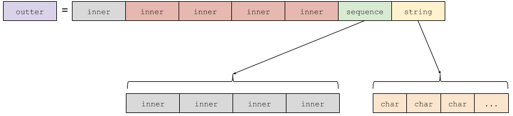

# xtypes
Lightweight C++ implementation of dds-xtypes.

## Getting Started
Given the following IDL:

```c++
struct Inner {
    long a;
};

struct Outter {
    long b;
    Inner c;
};
```

You can create the representative code that define these IDL types using xtypes:

```c++
StructType inner("Inner");
outter.add_member("a", primitive_type<int>());

StructType outter("Outter");
outter.add_member("b", inner);
outter.add_member("c", primitive_type<int>());
```

Once you defined the types, you can instatiate them and access to their data easily:
```c++
DynamicData data(outter);
//write value
data["b"]["a"].value(42);

// read value
int my_value = data["b"]["a"].value<int>();
```

## Why use *eProsima xtypes*?
- **OMG standard**: *eProsima xtypes* is based on the [dds-xtypes standard](https://www.omg.org/spec/DDS-XTypes/About-DDS-XTypes/) from the omg.
- **C++11 API**: it uses most modern features of C++11 to offer a really easy API to use.
- **Memory lightweight**: data instances use the same memory as types builts by the compiler.
There is no memory penalty using *eProsima xtypes* in realtion to compiled types.
- **Fast**: really small cost accesing to data members.
- **Header only library**: avoid the linking problems.
- **No external dependency**: *eProsima xtypes* only uses tools from std.
- **Easy to use**: Compresive API and intuitive concepts.

## API usage
*Examples can be found in [example folder](../../examples/ModernC++/xtypes).* folder

### Type definition
All types inherit from DynamicType as the following diagram represents:


#### PrimitiveType
Represents the basic type of the system.
For creating a `PrimitiveType`, a helper function must be used:
```c++
const DynamicType& t = primitive_type<T>();
```
where `T` can be one of the following basic types:
`char` `uint8_t` `int16_t` `uint16_t` `int32_t` `uint32_t` `int64_t` `uint64_t` `float` `double` `char32`

#### Collection Type
There are several collection types:

- `ArrayType`: for a fixed size arrange of elements. Similar to *C* arrays.
- `SequenceType`: for a variable size arrange of elements. Equivalent to `std::vector` in *C++*
- `StringType`: for a variable size arrange of chars. Similar to `std::string` in *C++*

```c++
ArrayType a1(primitive_type<int>(), 10); //size 10
ArrayType a2(structure, 10); //Array of structures (structure previously defined as StructType)
SequenceType s1(primitive<float>()); //unbounded sequence
SequenceType s2(primitive<float>(),30); //bounded sequence, max size will be 30
SequenceType s3(SequenceType(structure), 20); //bounded sequence of unbounded sequences of structures.
StringType str1; //unbounded string
StringType str2(50); //bounded string
```

#### StructType
You can specify an `StructType` given the type name of the structure.
```c++
StructType my_struct("MyStruct");
```
Similar to a *C struct*, `StructType` represents an aggregation of members.
Once it has been declared, any number of members can be added.
```c++
my_struct.add_member(Member("m_a", primitive_type<int>()));
my_struct.add_member(Member("m_b", StringType()));
my_struct.add_member(Member("m_c", primitive_type<double>().key().id(42))); //with annotations
my_struct.add_member("m_d", ArrayType(25)); //shortcut version
my_struct.add_member("m_e", other_struct)); //member of structs
my_struct.add_member("m_f", SequenceType(other_struct))); //member of sequence of structs
```
Note: once a `DynamicType` is added to an struct, a copy is performed (excepts for `PrimitiveType`).
This allow to modify the `DynamicType`s without side effects, and facilitate the memory management by the user.

#### `is_subset_of` function of `DynamicType`
Any `DynamicType` can be tested with another `DynamicType` in a *subset* evaluation.
```c++
tested_type.is_subset_of(other_type, type_consistency);
```
The previous sentence will be evaluate `true` if it is possible to get an instance of `tested_type`
that could be compatible with an instance of `other_type`.
This evaluation can be parametrized enabling any set of the following type consistency QoS Policies,
(that will be applied for the entire nested tree of `DynamicType`s):

- `NONE`: by default. The subset evaluation is analogous as an equal evaluation.
- `IGNORE_TYPE_WIDTH`: the subset evaluation will be true if the width of the primitive type is less or equals than the other type.
  Otherwise, only the equailty is take into account.
- `IGNORE_SEQUENCE_BOUNDS`: the subset evaluation will be true if the bounds of the `SequenceType` is less or equals than the other type.
  Otherwise, only `SequeceType`s with the same bounds can be matched.
- `IGNORE_ARRAY_BOUNDS`: same as `IGNORE_SEQUENCE_BOUNDS` but for the case of `ArrayType`.
- `IGNORE_STRING_BOUNDS`: same as `IGNORE_SEQUENCE_BOUNDS` but for the case of `StringType`.
- `IGNORE_MEMBER_NAMES`: if enabled, the matching between aggregated types will be by type instead of beeing by type and name.
- `IGNORE_MEMBERS`: if enabled, only members of the tested type will be checked to match with the next type.

### Data instantation
In order to instantiate a data from a DynamicType is only necessary to call the DynamicData constructor:
```c++
DynamicData data(my_defined_type);
```
This line allocates all the memory necesary to hold the data of `my_defined_type`.
It is important to know that the type must have a higher lifetime than the DynamicData,
because the DynamicData only save a references to it.

Depends of the type, the data will be behave in different ways.
The following methods are available to use when:
1. `DynamicData` represents a PrimitiveType (of `int` as example):
  ```c++
  data.value(42); //sets the value to 42
  int value = data.value<int>(); //read the value
  ```
2. `DynamicData` represents a StringType
  ```c++
  data.value<std::string>("Hello data!"); //sets the string value
  data.string("Hello again!"); // shortcut version for string
  const std::string& s1 = data.value<std::string>(); //read the string value
  const std::string& s2 = data.string(); // shortcut version for string
  ```
3. `DynamicData` represents a CollectionType
  ```c++
  size_t size = data.size(); //size of collection
  data[2].value(42); // set value 42 to position 2 of the collection.
  int value = data[2].value<int>(); // get value from position 2 of the collection.
  data[2] = dynamic_data_representing_a_value;
  WritableDynamicDataRef ref = data[2]; //references to a DynamicData that represents a collection
  ```
4. `DynamicData` represents a SequenceType
  ```c++
  data.push(42); // push back new value to the sequence.
  data.push(dynamic_data_representing_a_value);
  ```
5. `DynamicData` represents an AggregationType
  ```c++
  data["member_name"].value(42); //set value 42 to the int member called "member_name"
  int value = data["member_name"].value<int>(); //get value from int member called "member_name"
  data["member_name"].value(dynamic_data_representing_a_value);
  WritableDynamicDataRef ref = data["member_name"];
  ```

#### References to `DynamicData`
There are two ways to obtain a references to a `DynamicData`:
1. `ReadableDynamicDataRef` for `const` references.
2. `WritableDynamicDataRef` for mutable references.

A reference no contain any value, only points to an already existing `DynamicData`, or part of it.
You can get a reference when access with the `[]` operator or calling the `ref()` and `cref()` methods of a `DynamicData`.
You will obtain a `ReadableDynamicDataRef` or a `WritableDynamicDataRef` depending if theses methods are
calling from a `const DynamicData` or from a `DynamicData` itself.

#### `is_less_equals_than` function of `DynamicData`
Analogous to type matching, but over the values of `DynamicData`.
```c++
tested_data.is_less_equals_of(other_data, type_consistency);
```
It checks that the tested data will be less or equals than the compared data.
As `is_subset_of`, this function also accepts type consistency QoS policies.
(See the `is_subset_of` section).
//TODO

#### `for_each` function of `DynamicData`
This function offers an easy way to iterate the `DynamicData` tree.
The function receive a callback that will be called for each node of the tree.
```c++
data.for_each([&](const DynamicData::ReadableNode& node)
{
    switch(node.type().kind())
    {
        case TypeKind::STRUCTURE_TYPE:
        case TypeKind::SEQUENCE_TYPE:
        case TypeKind::ARRAY_TYPE:
        case TypeKind::STRING_TYPE:
        case TypeKind::UINT_32_TYPE:
        case TypeKind::FLOAT_32_TYPE:
        //...
    }
});
```
The `node` parameter of the callback can be a `ReadableNode` or `WritableNode` depends of the mutability of the `DynamicData`,
and has the following methods that allows to introspect the node
```c++
node.data() // for a view of the data
node.type() // related type
node.deep() // nested deep
node.parent() // parent node in the data tree
node.access().index() // index used for access from parent to this node
node.access().member() // member used for access from parent to this node
```
Note: `node.data()` will return a `ReadableDynamicDataRef` or a `WritableDynamicDataRef` depending of the node type.

## Performance
The `DynamicData` instance only uses the minimal allocations needed to store the data.
If its associated type only contains the following (nested) types: `PrimitiveType`, `StructType`, or `ArrayType`;
the memory required can be performed with only **one allocation** at the creation of the DynamicData.
Only if the type contains some `MutableCollectionType`, another allocation will be performed to manage the inner types of that mutable type.

Let see an example:
```c++
StructType inner("Inner");
inner.add_member("m_int", primitive_type<int>());
inner.add_member("m_float", primitive_type<float>());
inner.add_member("m_array", ArrayType(primitive_type<uint16_t>(), 4));

DynamicData data(inner);
```
This `DynamicData` will be represented in memory as follow, with only one allocation:


The next complex type:
```c++
StructType outter("Outter");
outter.add_member("m_inner", inner);
outter.add_member("m_array_inner", ArrayType(inner, 4));
outter.add_member("m_sequence_inner", SequenceType(inner, 4));
outter.add_member("m_string", StringType());

DynamicData data(outter);
```
Needs two more allocations, one for the secuence, and another one for the string:


