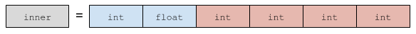

# xtypes
Lightweight C++ implementation of dds-xtypes.

## Getting Started
Given the following IDL,

```c++
struct Inner {
    long a;
};

struct Outer {
    long b;
    Inner c;
};
```

you can create the representative C++ code defining this IDL's types using *xtypes*:

```c++
StructType inner("Inner");
outer.add_member("a", primitive_type<int32_t>());

StructType outer("Outer");
outer.add_member("b", inner);
outer.add_member("c", primitive_type<int32_t>());
```

Once these types have been defined, you can instatiate them and access their data:
```c++
//create the DynamicData accordingly with the recently created "Outer" DynamicType
DynamicData data(outer);
//write value
data["b"]["a"].value(42);
data["b"]["a"] = 23; //shortcut 

// read value
int32_t my_value = data["b"]["a"].value<int32_t>();
```

## Why should you use *eProsima xtypes*?
- **OMG standard**: *eProsima xtypes* is based on the
  [dds-xtypes standard](https://www.omg.org/spec/DDS-XTypes/About-DDS-XTypes/) from the *OMG*.
- **C++11 API**: *eProsima xtypes* uses C++11 latest features, providing  an easy-to-use API.
- **Memory lightweight**: data instances use the same memory as types builts by the compiler.
  No memory penalty is introduced by using *eProsima xtypes* in relation to compiled types.
- **Fast**: Accesing to data members is swift and quick.
- **Header only library**: avoids the linking problems.
- **No external dependency**: *eProsima xtypes*'s only dependencies are from *std*.
- **Easy to use**: Compresive API and intuitive concepts.

## API usage
*Examples can be found in [example folder](../../examples/ModernC++/xtypes).*

The API is divided into two different and yet related conceps.
1. Type definition: classes and methods needed for your runtime type definition.
2. Data instance: set of values organized accordingly with its own type definition.

### Type definition
All types inherit from the base abstract type `DynamicType` as shown in the following diagram:


#### PrimitiveType
Represents the system's basic types.
In order to create a `PrimitiveType`, a helper function must be used:
```c++
const DynamicType& t = primitive_type<T>();
```
with `T` being one of the following basic types:
`bool` `char` `wchar_t` `uint8_t` `int16_t` `uint16_t` `int32_t` `uint32_t` `int64_t` `uint64_t` `float` `double`
`long double`

#### Collection Type
As pointed by the self-explanatory name, CollectionTypes provide a way to create the most various collections.
There are several collection types:

- `ArrayType`: fixed-size set of elements. Similar to *C-like* arrays.
- `SequenceType`: variable-size set of elements. Equivalent to *C++* `*std::vector`
- `StringType`: variable-size set of char-type elements. Similar to *C++* `std::string`
- `WStringType`: variable-size set of wchar-type elements. Similar to *C++* `std::wstring`

```c++
ArrayType a1(primitive_type<int32_t>(), 10); //size 10
ArrayType a2(structure, 10); //Array of structures (structure previously defined as StructType)
SequenceType s1(primitive<float>()); //unbounded sequence
SequenceType s2(primitive<float>(),30); //bounded sequence, max size will be 30
SequenceType s3(SequenceType(structure), 20); //bounded sequence of unbounded sequences of structures.
StringType str1; //unbounded string
StringType str2(50); //bounded string
WStringType wstr(); //unbounded wstring
```

#### StructType
Similarly to a *C-like struct*, a `StructType` represents an aggregation of members.
You can specify a `StructType` given the type name of the structure.
```c++
StructType my_struct("MyStruct");
```
Once the `StructType` has been declared, any number of members can be added.
```c++
my_struct.add_member(Member("m_a", primitive_type<int32_t>()));
my_struct.add_member(Member("m_b", StringType()));
my_struct.add_member(Member("m_c", primitive_type<double>().key().id(42))); //with annotations
my_struct.add_member("m_d", ArrayType(25)); //shortcut version
my_struct.add_member("m_e", other_struct)); //member of structs
my_struct.add_member("m_f", SequenceType(other_struct))); //member of sequence of structs
```
Note: once a `DynamicType` is added to an struct, a copy is performed.
This allows modifications to `DynamicType` to be performed without side effects.
It also and facilitates the user's memory management duties.

#### `is_compatible` function of `DynamicType`
Any pair of `DynamicType`s can be checked for their mutual compatibility.
```c++
TypeConsistency consistency = tested_type.is_compatible(other_type);
```
This line will evaluate consistency levels among the two types.
The returned `TypeConsistency` is going to be a subset of the following *QoS policies*:

- `NONE`: Unknown way to interpret `tested_type` as `other_type`.
- `EQUALS`: The evaluation is analogous to an equal evaluation.
- `IGNORE_TYPE_WIDTH`: the evaluation will be true if the width of the some primitive types are less or
  equals than the other type.
- `IGNORE_SEQUENCE_BOUNDS`: the evaluation will be true if the bounds of the some sequences are less or
  equals than the other type.
- `IGNORE_ARRAY_BOUNDS`: same as `IGNORE_SEQUENCE_BOUNDS` but for the case of arrays.
- `IGNORE_STRING_BOUNDS`: same as `IGNORE_SEQUENCE_BOUNDS` but for the case of string.
- `IGNORE_MEMBER_NAMES`: the evaluation will be true if the names of some members differs (but no the position).
- `IGNORE_OTHER_MEMBERS`: the evaluation will be true if some members of `other_type` are ignored.

Note: `TypeConsistency` is an enum with `|` and `&` operators overrided to manage it as a set of QoS policies.

### Data instance
#### Initialization
To instantiate a data, only is necessary a `DynamicType`:
```c++
DynamicData data(my_defined_type);
```

This line allocates all the memory necesary to hold the data defined by `my_defined_type`
and initializes their content to *0* or to the corresponding *default values*.
Please, note that the type must have a higher lifetime than the DynamicData,
since `DynamicData` only saves a reference to it.
Other ways to initalizate a `DynamicData` are respectively *copy* and *compatible copy*.

```c++
DynamicData data1(type1); //default initalization
DynamicData data2(data1); //copy initialization
DynamicData data3(data1, type2); //compatible copy initialization
```

The last line creates a compatible `DynamicData` with the values of `data1` that can be accessed being a `type2`.
To archieve this, `type2` must be compatible with `type1`.
This compatibility can be checked with `is_compatible` function.

#### Internal data access
Depending on the type, the `DynamicData` will behave in different ways.
The following methods are available when:
1. `DynamicData` represents a `PrimitiveType` (of `int` as example):
    ```c++
    data.value(42); //sets the value to 42
    data = 23; // Analogous to the one above, assignment from primitive, sets the value to 23
    int32_t value = data.value<int32_t>(); //read the value
    ```
1. `DynamicData` represents an `AggregationType`
    ```c++
    data["member_name"].value(42); //set value 42 to the int member called "member_name"
    data[2].value(42); //set value 42 to the third int member called "member_name"
    data["member_name"] = 42; //set value 42 to the int member called "member_name"
    data[2] = 42; //set value 42 to the third int member called "member_name"
    int32_t value = data["member_name"].value<int32_t>(); //get value from int member called "member_name"
    data["member_name"].value(dynamic_data_representing_a_value);
    WritableDynamicDataRef ref = data["member_name"];
    size_t size = data.size(); //number of members
    ```
1. `DynamicData` represents a `CollectionType`
    ```c++
    data[2].value(42); // set value 42 to position 2 of the collection.
    data[2] = 42; // set value 42 to position 2 of the collection.
    int32_t value = data[2].value<int32_t>(); // get value from position 2 of the collection.
    data[2] = dynamic_data_representing_a_value;
    WritableDynamicDataRef ref = data[2]; //references to a DynamicData that represents a collection
    size_t size = data.size(); //size of collection
    ```
1. `DynamicData` represents a `StringType`
    Same as `CollectionType` plus:
    ```c++
    data.value<std::string>("Hello data!"); //sets the string value
    data.string("Hello again!"); // shortcut version for string
    data = "Hello again!"; // assignment version for string
    const std::string& s1 = data.value<std::string>(); //read the string value
    const std::string& s2 = data.string(); // shortcut version for string
    ```
1. `DynamicData` represents a `WStringType`
    Same as `CollectionType` plus:
    ```c++
    data.value<std::wstring>(L"Hello data! \u263A"); //sets the string value
    data.wstring(L"Hello again! \u263A"); // shortcut version for string
    data = L"Hello again! \u263A"; // assignment version for string
    const std::wstring& s1 = data.value<std::wstring>(); //read the string value
    const std::wstring& s2 = data.wstring(); // shortcut version for string
    ```
1. `DynamicData` represents a `SequenceType`
    Same as `CollectionType` plus:
    ```c++
    data.push(42); // push back new value to the sequence.
    data.push(dynamic_data_representing_a_value);
    data.resize(20); //resize the vector (same behaviour as std::vector::resize())
    ```

#### References to `DynamicData`
There are two ways to obtain a reference to a `DynamicData`:
1. `ReadableDynamicDataRef` for constant references.
2. `WritableDynamicDataRef` for mutable references.

A reference does not contain any value and only points to an already existing `DynamicData`, or to part of it.
You can obtain a reference by accessing data with `[]` operator or by calling `ref()` and `cref()`.
Depending on whether the reference comes from a `const DynamcData` or a `DynamicData`, a `ReadableDynamicDataRef`
or a `WritableDynamicDataRef` is returned.

#### `==` function of `DynamicData`
A `DynamicData` can be compared in depth with another one.
The type should be the same.

#### `for_each` function of `DynamicData`
This function provides an easy way to iterate the `DynamicData` tree.
`for_each` receive a visitor callback that will be called for each node of the tree.
```c++
data.for_each([&](const DynamicData::ReadableNode& node)
{
    switch(node.type().kind())
    {
        case TypeKind::STRUCTURE_TYPE:
        case TypeKind::SEQUENCE_TYPE:
        case TypeKind::ARRAY_TYPE:
        case TypeKind::STRING_TYPE:
        case TypeKind::UINT_32_TYPE:
        case TypeKind::FLOAT_32_TYPE:
        //...
    }
});
```
The `node` callback parameters can be either `ReadableNode` or `WritableNode`, depending on `DynamicData` mutability,
and provides the following methods for introspection
```c++
node.data() // for a view of the data
node.type() // related type
node.deep() // nested deep
node.parent() // parent node in the data tree
node.from_index() // index used when accessed from parent to this node
node.from_member() // member used when accessed from parent to this node
```
Note: `node.data()` will return a `ReadableDynamicDataRef` or a `WritableDynamicDataRef` depending of the node type.

In order to break the tree iteration, the user can throw a boolean value.

For example:
```c++
case TypeKind::FLOAT_128_TYPE: // The user app does not support 128 float values
    throw false; // Break the tree iteration
```
The boolean exception value will be returned by `for_each` function call.
If the visitor callback implementation does not call an exception, `for_each` function returns `true` by default.

## Performance
The `DynamicData` instance uses the minimal allocations needed to store any data.
If its associated type only contains the following (nested) types: `PrimitiveType`, `StructType`, or `ArrayType`;
the memory required can be allocated with only **one allocation** during the creation phase of the `DynamicData`.
On the other hand, each inner `MutableCollectionType` will trigger a further allocation.

Let see an example:
```c++
StructType inner("Inner");
inner.add_member("m_int", primitive_type<int32_t>());
inner.add_member("m_float", primitive_type<float>());
inner.add_member("m_array", ArrayType(primitive_type<uint16_t>(), 4));

DynamicData data(inner);
```
Such data will be represented in memory as follows. Only one memory allocation is needed:


The next complex type:
```c++
StructType outer("Outer");
outer.add_member("m_inner", inner);
outer.add_member("m_array_inner", ArrayType(inner, 4));
outer.add_member("m_sequence_inner", SequenceType(inner, 4));
outer.add_member("m_string", StringType());

DynamicData data(outer);
```
In this case, two allocations will be needed: one for the sequence, and a second one for the string:


## Debugging DynamicData
As a `DynamicData` is fully built at runtime, no static checks can ensure its correct behaviour.
As an attempt to solve this, asserts have been placed accross various methods to avoid the overload of checks in
*release mode*.
We strongly recommend to compile in *debug mode* during developing phase: this will allow `xtypes` library to
perform all possible checks.
Following the same line of thoughts, in order to improve the performance the final product should be compiled in
*release mode*. In this case, no checks will be performed.

Reminder: `assert` function from `std` emit an *abort* signal.
If you need more information about why a concrete `assert` was reached, the *stacktrace* is really useful.
