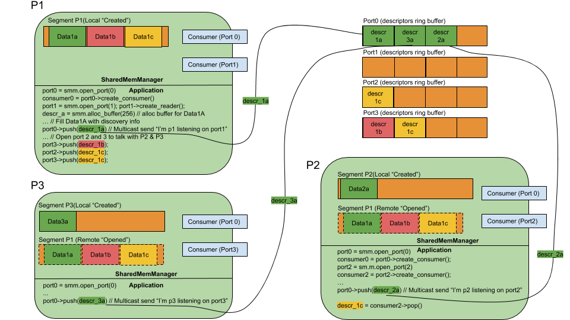
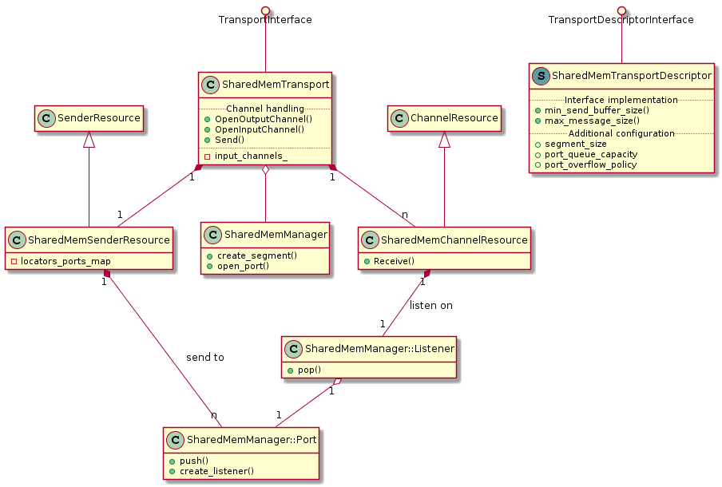

# Interprocess Shared Memory model

## Overview

This document describes a model for interprocess shared memory communication of software components interchanging data messages. The objective of the model is to provide a shared memory based transport layer suitable for a Real-time Publish-Subscribe DDS (Data Distribution Service).

## Context

eProsima has received commercial proposals to implement a shared memory transport as an improvement of its FastRPTS product. The goals listed in this document are extracted from the customers proposals.

### Improvements over the standard network transports

* Reduce OS Kernel calls: This is unavoidable for transports like UDP / TCP (even with the loopback interface).
* Large message support: Network stacks needs to fragment large packets.
* Avoid data serialization / deserialization process: This is not possible in heterogeneous networks, but is possible in shared memory interprocess communication.
* Reduce memory copies: A buffer can be shared directly with several readers without additional copies.

### Objectives 

* Increase the communications performance of processes in the same machine.
* Create a portable shared memory library (Windows / Linux / MacOS).
* Documentation.
* Tests
* Examples / Tutorials.

## Architecture

### Design concepts

* **Segment**: Is a block of shared memory of fixed size that can be accessed from different processes. Shared memory segments have a global name so any process who knows the name can open the segment and map it in its address space.

* **SegmentId**: SegmentIds are names that uniquely identify shared memory segments, these names are 16 characters UUIDs.

* **Shared memory buffer**: Is a buffer allocated in the shared memory segment. 

* **Buffer descriptor**: Shared memory buffers can be referenced by buffers descriptors, these descriptors act like pointers to a buffer that can be copied between processes with a minimum cost. A descriptor contains the SegmentId and the offset to the data from the base of the segment.

* **Shared memory port**: Is a communication channel identified by a port_id(uint32_t number). Through this channel, buffer descriptors are sent to other processes. It has a ring-buffer, in shared memory, where descriptors are stored. The same port can by opened by several processes for reading and writing operations. Multiple listeners can be registered in a port to be notified when descriptors are pushed to the ring-buffer. Multiple data producers can push descriptors to a port. The port contains an atomic counter with the number of listeners registered on it, each position in the ring-buffer has also a counter initialized to the number of listeners, as listeners read the descriptor, decrement the counter, so the ring-buffer position will be considered free when the counter is zero. The port also has an interprocess condition variable where the listeners will wait for incoming descriptors.

* **Listener**: Listeners listen to descriptors pushed to a port. The Listener provides an interface for the application to wait and access to the data referenced by the descriptors. When a consumer pops a descriptor from the port listener, look at the descriptor's SegmentId field to open the origin shared memory segment (if not already opened in this process), once the origin segment is mapped locally, the consumer is able to access the data using the offset field contained in the descriptor.

* **SharedMemoryManager**: Applications instantiate this object in order to access the shared memory resources described above. At least one per process memory manager is required. The manager provides functionality for the application to create shared memory segments, alloc data buffers in the segments, push buffer descriptors to shared memory ports and create listeners associated to a port.

### Example scenario

Let's study the above example. There are three processes with a SharedMemManager per process, every process creates its own shared memory segment intended to store the buffers that will be shared with other processes.

P1, P2 and P3 processes are participants in a RTPS-DDS environment. Discovery of participants is done by using multicast, so we have selected shared memory port0 as "multicast" port for discovery, therefore, first thing all participants do is to open the shared memory port0. A listener attached to port0 is created too, by every participant, to read the incoming descriptors.

Each participant opens a port to receive unicast messages, ports 1, 2 and 3 respectively, and create listeners associated to those ports.

The first message the participants send is the multicast discovery message: "I'm here, and I am listening on portN". So they alloc a buffer in its local segment, write that information to the buffer and push the buffer's descriptor through the port0. Observe how port0's ring-buffer store the descriptors to Data1a(P1), Data2a(P2), Data3a(P3) after all processes have pushed their discovery descriptors.

After the discovery phase, participants know the other participants and their "unicast" ports so they can send messages to specific participants by pushing to the participant's unicast port.

Finally, let's observe how P1 is sharing Data1c with P2 and P3, this is done by pushing the buffer descriptor to P2 and P3 unicast ports. This way one shared memory buffer can be shared with several processes without making any copy of the buffer (just copy the descriptors). This is an important improvement with respect to transports like UDP and TCP.

### Design considerations

* **Minimize global interprocess locks**: Interprocess locks are dangerous because, in the case one of the involved processes crashes while holding an interprocess lock, all the collaborating processes could be affected. In this design, pushing data to a port and reading data from the port are lock-free operations. For performance reasons waiting for data on a port, when the port is empty, requires interprocess lock mecanishms like mutexes and condition variables. This is specially dangerous in multicast ports because if one listener crashes while waiting this could block the port for the rest of the listeners. More complex design features could be added to make the library fault-tolerance, but it will possibly be at a cost of losing performance.

* **Scalable number of processes**: Every process creates its own shared memory segments to store the locally generated messages. This is more scalable than having a global segment shared between all the involved processes. 

* **Per application / process customizable memory usage**: Again, a local shared memory segment allows to adapt the size of the segments to the requirements of the application. Imagine for example an application sending two types of data: Video and status info. It could create a big segment to store video frames, and a small segment for the status messages.

### Future improvements

* **Fault tolerance**: As stated in the design considerations, the possibility of a process crashing holding interprocess resources is real. Implementing fault tolerance for these cases is not an easy task. Timeouts, keep alive checks and garbage collectors are some of the things that could be added to the initial design in order to achieve fault tolerance. This will be considered in future revisions.

### Mapping the design to FastRTPS

#### Transport Layer

* **Locators**: LOCATOR_KIND_SHM Is defined to identify shared memory transport endpoints. Locator_t fields are filled in this way:
    * kind: 16 (Is the RTPS vendor-specific range).
    * port: The locator's port contains the shared memory port_id.
    * address: The whole address is set to 0 except for the first byte that is used to mark unicast (address[0]='U') or multicast (address[0]='M').

* **SharedMemTransportDescriptor**: The following values can be customized:
    * segment_size: Size of the shared memory segment reserved by the transport.
    * port_queue_capacity: Size, in number of messages, of the shared memory port message queue.
    * port_overflow_policy: DISCARD or FAIL.
    * segment_overflow_policy: DISCARD or FAIL
    * max_message_size: By default max_message_size will be the segment_size, but is possible to specify a value <= segment_size. In that case fragmentation could occur.

* **Default metatraffic multicast locator**: One locator, the port will be selected by the participant (will be the same as in the RTPS standard for UDP).

* **Default metatraffic unicast locator**: One locator, the port will be selected by the participant (default port_id will be the same as in the RTPS standard for UDP).

* **Default output locator**: There will be no default output locator.

* **OpenInputChannel**: A SharedMemChannelResource instance will be created. An opened channels vector is maintained, if the same input locator is opened several times the channel instance is reused.

* **OpenOutputChannel**: There will be only one SharedMemSenderResource instance per transport instance, an unordered_map of opened ports will be maintained by the SharedMemSenderResource object in order to match the destination locators to the shared memory ports.

## Class design

#### RTPS Layer

In FastRTPS transports are associated to participants, so the new SHM transport can used, by adding an instance of a SharedMemTransportDescriptor class to the list of participant's user transports.
So there is a shared memory segment per participant that will be shared by all participant's publishers.

Transport selection: As RTPSParticipant is able to have multiple transports, a transport selection mecanishm is necessary when communicating with other participants reachable by several transports. The defined behaviour here is: If the participants involved are in the same host and both have SHM transport configured, then SHM transport is selected for all communications between those participants.
