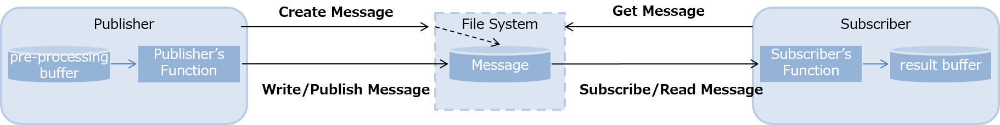
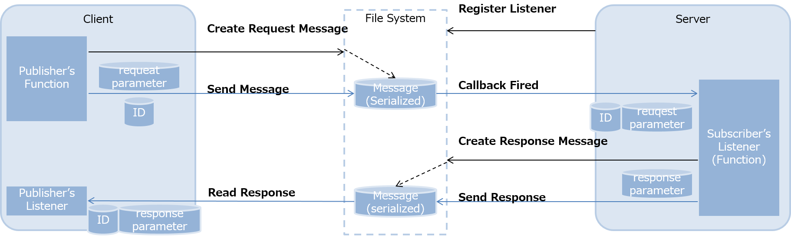
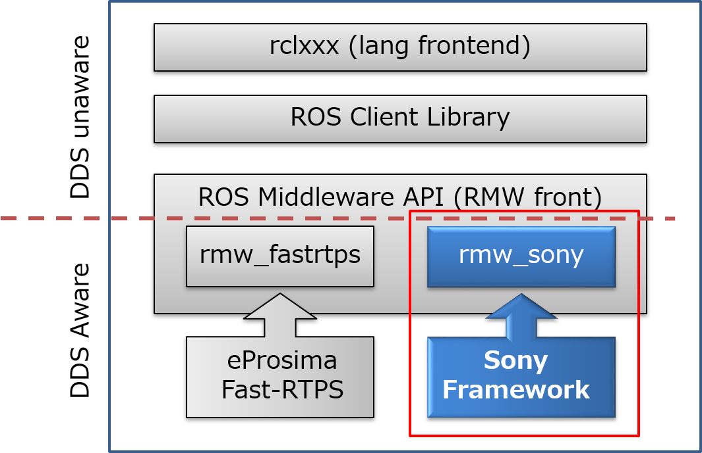
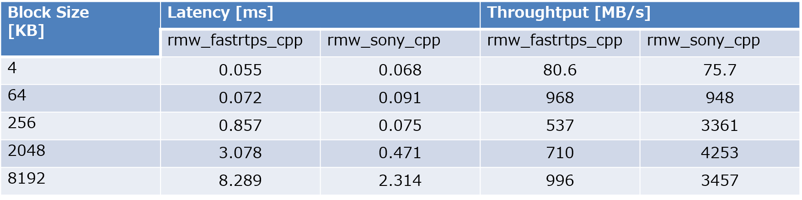

# Overview

Sony has already done implementation using internal shared memory light framework to connect rmw layer, so that ROS2 applicatoin can use the shared memory publisher/subscriber framework without notice. This is the same target for milestone-2, so this documentation describe about the history and feasibilities, and also basic design for shared memory data sharing in linux system.

# Background

- We need to deal with a large amount of data for recognitions, robotics, intelligent processes like agent device. The data has to be shared among a lot of framework and process spaces, otherwise copy in/out system space overhead will stress the system resources. especially embedded devices, this could be fatal issue.
- It is impossible to complete the requirement with single process even if that is the embedded consumer devices. Data shall be shared in the host system efficiently so that application can use the data without concern. Besides data size is getting bigger and bigger such as 4K, 8K images, ToF, Lidar, Radar, PointCloud and so on. We surely need more band width/high latency data sharing against these situations.

# Requirements

### Publisher/Subscriber Architecture (N:N)

Publisher: after system calls to map and create message on the filesystem, it will directly write the dat into the message. Then at the finish writing or closing file, that will be notified to the subscriber with file path.

Subscriber: file path will be notified via inotify, the subscriber to get the correspoing message to open and read directly.

**There will be no copy insluding user application or framework itself**

### Remote Procedure Call Support (1:1 asynchronous, such as rosservice)

Unique ID assigned for each message, so easy to recognize who’s message.

- Perfectly Copyless Data Sharing
- Low Latency and High Throughput
- Message Lifecycle and Timestamp support
- Data Access Control via Filesystem
- Storage supported as backend (user flexibility)

# Design

## Platform

Linux 2.6.13 or later (technically the platform supports [inotify](http://man7.org/linux/man-pages/man7/inotify.7.html))

## Data Channel

Basically in-memory file system such as ramfs or tmpfs. but this is not a limitation or constraints, user can choose the backend file system to specify the root directory. ramfs and tmpfs is actually memory storage, but it can keep the file on the filesystem as long as system running. this would be also good, once the system reboots it will refresh the entire cache data, we can restart as clean.

Taking advantage of linux interfaces such as map/unmap to assign the physical pages into the user process space, no additional overhead or stack will be provided from this framework.

## Signal and Event Notification

from our experience and benchmark on embedded linux system, [inotify](http://man7.org/linux/man-pages/man7/inotify.7.html) came up the candidate number 1. inotify is also provied by linux kernel and it allows us to notify events on filesystem and what kind of events and what file is actually changed.(written, closed or opened etc.) this is really simple linux kernel interface and also support message queue order guranteed by linux kernel.

## Access Permission Control

since this framework is constructed on filesystem based storage, we can control access permission just like we do with normal files and user/group permission control. without certain group or access permission, user cannot even see the files or any activities by this framework.

## Datatype / Serialization

Do not serialize data into the shared memory with publish/subscribe. So user application needs to be aware before to write/read the binary data fits in the certain structure.

## Remarkable Features (Only Related)

- Configurable parameters for each topic
  root file path and ring buffer length to keep for each topic shall be predefined.
- Ring Buffer / File Mapped Shared Memory
  Ring Buffer is controlled by framework, e.g) entfies of single topic.
- Retain Memory
  once the file is mapped into physical page, it will never unmapped unless it is necessary.
  this will reduce the huge system time via system calls.
- Huge TLB
  also reduce system time for cache miss, pagefaults and tlb miss hit.

# Feasibilities

With Sony internal framework and rmw_sony_cpp to connect the implementation to ROS2 frontend, there is a huge performance improvemnent that we have taking advantage of shared memory.

of course this is only prototype and Non-DDS implementation which means in general there is not a lot of processes that is required with DDS implementation. But even anticipated value expectation in prototype, there is an improvement as followings.

- Publisher:Subscriber = 1:1
- Serializer is [Fast-CDR](https://github.com/eProsima/Fast-CDR)
- Ubuntu 18.04 ROS Dashing
- Skylake PC

# Note

This is just for sharing primitives, but we can work on this feature more generic way and keep the improvement as it is.
