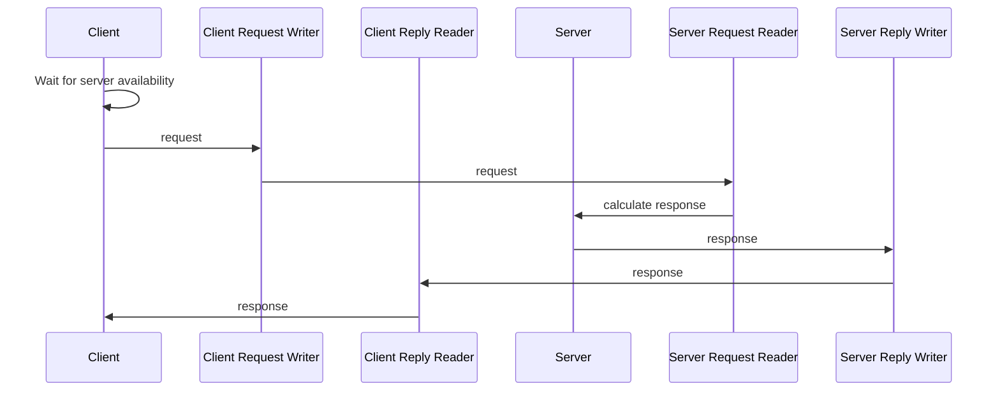

# Request-Reply example

The *eProsima Fast DDS Request-Reply* example shows how to create a service oriented architecture using the *Request-Reply* communication pattern over Fast DDS.

This example is part of the suite of examples designed by eProsima that aims to illustrate the features and possible configurations of DDS deployments through *eProsima Fast DDS*.

This *request_reply* example shows a simple approach for a multi-server multi-client architecture, where servers are both prepared to reply to several clients, and also to be run alongside other server instances (to provide redundancy).
In this example, the clients take one "calculator" operation as input, and exit as soon as any of the servers has provided a response for their request.

* [Description of the example](#description-of-the-example)
* [Run the example](#run-the-example)
* [XML profile playground](#xml-profile-playground)

## Description of the example

The RPC like communication pattern is implemented using a pair of related topics, one for the request and one for the reply.
The approach creates the following data flow for a request-reply operation:



## Run the example

To launch this example, two different terminals are required.
One of them will run the server application, and the other will run the client application.
Mind that it is possible to run multiple server instances and client instances simultaneously.

### Server

* Ubuntu ( / MacOS )

    ```shell
    user@machine:example_path$ ./request_reply server
    2024-07-01T16:26:45.314 [INFO] [ServerApp] Server initialized with ID: 01.0f.cc.6d.01.3d.fd.74.00.00.00.00
    2024-07-01T16:26:45.315 [INFO] [main] Server running. Please press Ctrl+C to stop the Server at any time.
    ```

* Windows

    ```powershell
    example_path> request_reply.exe server
    2024-07-01T16:26:45.314 [INFO] [ServerApp] Server initialized with ID: 01.0f.cc.6d.01.3d.fd.74.00.00.00.00
    2024-07-01T16:26:45.315 [INFO] [main] Server running. Please press Ctrl+C to stop the Server at any time.
    ```

### Client

* Ubuntu ( / MacOS )

    ```shell
    user@machine:example_path$ ./request_reply client 2 5
    2024-07-01T16:08:28.296 [INFO] [ClientApp] Client initialized with ID: 01.0f.cc.6d.21.0f.f0.6b.00.00.00.00
    2024-07-01T16:08:28.296 [INFO] [main] Client running. Please press Ctrl+C to stop the Client at any time.
    2024-07-01T16:08:29.296 [INFO] [ClientApp] Request sent with ID '1': '2 + 5'
    2024-07-01T16:08:29.296 [INFO] [ClientApp] Request sent with ID '2': '2 - 5'
    2024-07-01T16:08:29.297 [INFO] [ClientApp] Request sent with ID '3': '2 * 5'
    2024-07-01T16:08:29.297 [INFO] [ClientApp] Request sent with ID '4': '2 / 5'
    2024-07-01T16:08:29.297 [INFO] [ClientApp] Reply received from server 01.0f.cc.6d.92.0e.de.f0.00.00.00.00 to request with ID '1' with result: '7'
    2024-07-01T16:08:29.297 [INFO] [ClientApp] Reply received from server 01.0f.cc.6d.92.0e.de.f0.00.00.00.00 to request with ID '2' with result: '-3'
    2024-07-01T16:08:29.297 [INFO] [ClientApp] Reply received from server 01.0f.cc.6d.92.0e.de.f0.00.00.00.00 to request with ID '3' with result: '10'
    2024-07-01T16:08:29.297 [INFO] [ClientApp] Reply received from server 01.0f.cc.6d.92.0e.de.f0.00.00.00.00 to request with ID '4' with result: '0'
    ```

* Windows

    ```powershell
    example_path> request_reply.exe client 2 5
    2024-07-01T16:08:28.296 [INFO] [ClientApp] Client initialized with ID: 01.0f.cc.6d.21.0f.f0.6b.00.00.00.00
    2024-07-01T16:08:28.296 [INFO] [main] Client running. Please press Ctrl+C to stop the Client at any time.
    2024-07-01T16:08:29.296 [INFO] [ClientApp] Request sent with ID '1': '2 + 5'
    2024-07-01T16:08:29.296 [INFO] [ClientApp] Request sent with ID '2': '2 - 5'
    2024-07-01T16:08:29.297 [INFO] [ClientApp] Request sent with ID '3': '2 * 5'
    2024-07-01T16:08:29.297 [INFO] [ClientApp] Request sent with ID '4': '2 / 5'
    2024-07-01T16:08:29.297 [INFO] [ClientApp] Reply received from server 01.0f.cc.6d.92.0e.de.f0.00.00.00.00 to request with ID '1' with result: '7'
    2024-07-01T16:08:29.297 [INFO] [ClientApp] Reply received from server 01.0f.cc.6d.92.0e.de.f0.00.00.00.00 to request with ID '2' with result: '-3'
    2024-07-01T16:08:29.297 [INFO] [ClientApp] Reply received from server 01.0f.cc.6d.92.0e.de.f0.00.00.00.00 to request with ID '3' with result: '10'
    2024-07-01T16:08:29.297 [INFO] [ClientApp] Reply received from server 01.0f.cc.6d.92.0e.de.f0.00.00.00.00 to request with ID '4' with result: '0'
    ```

## XML profile playground

The *eProsima Fast DDS* entities can be configured through an XML profile from the environment.
This is accomplished by setting the environment variable ``FASTDDS_DEFAULT_PROFILES_FILE`` to path to the XML profiles file:

* Ubuntu ( / MacOS )

    ```shell
    user@machine:example_path$ export FASTDDS_DEFAULT_PROFILES_FILE=request_reply_profile.xml
    ```

* Windows

    ```powershell
    example_path> set FASTDDS_DEFAULT_PROFILES_FILE=request_reply_profile.xml
    ```

The example provides with an XML profiles files with certain QoS to ensure correct reception of the requests and replies.

- Reliable reliability: avoid sample loss.
- Transient local durability: enable late-join subscriber applications to receive previous samples.
- Keep-last history with high depth: ensure certain amount of previous samples for late-joiners.

Applying different configurations to the entities will change to a greater or lesser extent how the application behaves in relation to sample management.
